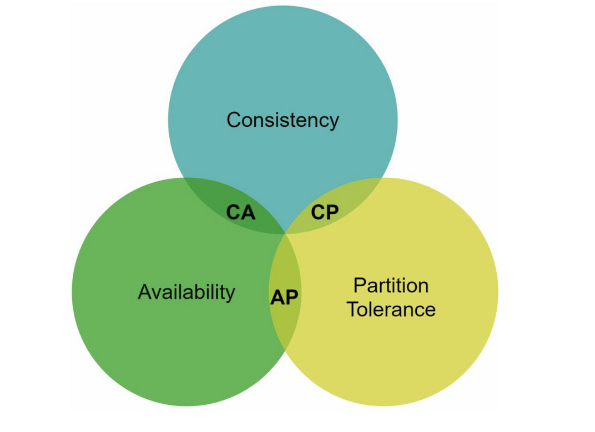
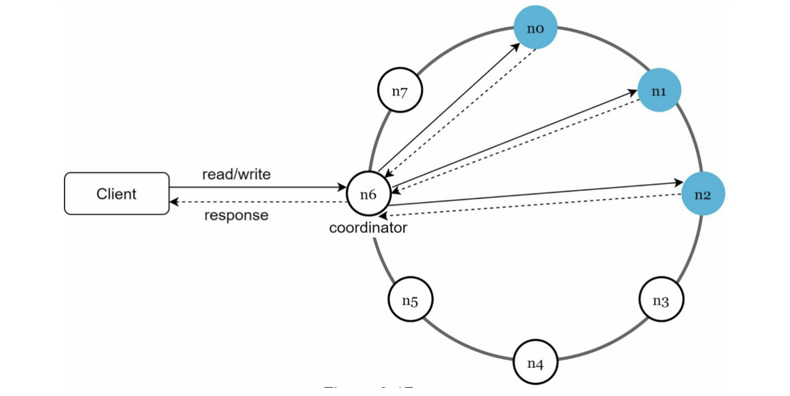
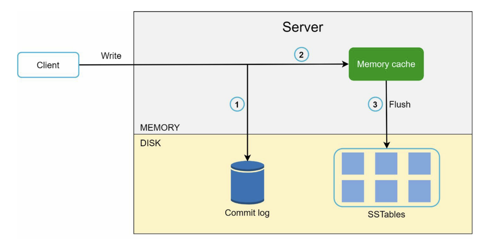
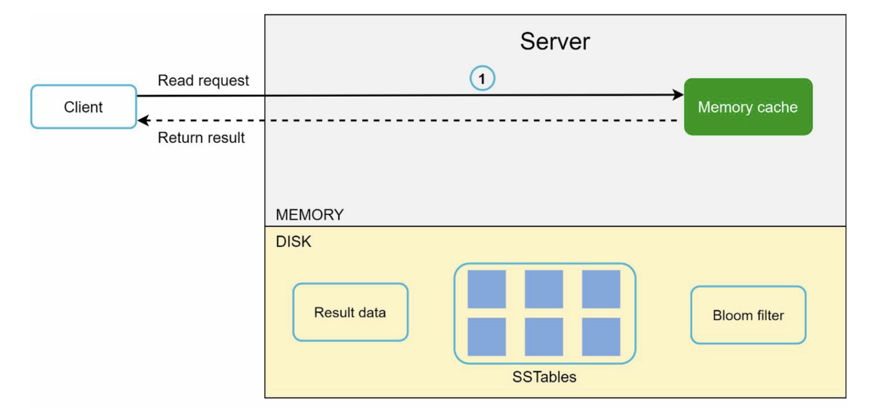

# :pushpin: 6장. 키-값 저장소 설계

- 키 값 저장소는 키-값 데이터베이스라고도 불리는 비관계형 데이터베이스
- 이 저장소에 저장되는 값은 고유 식별자를 키로 가져야 한다.
- 키-값 쌍에서의 키는 유일해야 하며 해당 키에 매달린 값은 키를 통해서만 접근할 수 있다.
- 키-값 쌍에서 값은 문자열일 수도 있고 리스트일 수도 있고 객체일 수도 있다.
- 키-값 저장소로 널리 알려진 것
  - 아마존 다이나모
  - memcached
  - 레디스

## 문제 이해 및 설계 범위 확정

```text
- key-value의 크기는 10kb 이하
- 큰 데이터 저장 가능
- HA, 장애 상황에도 빨리 응답해야함
- autoscaling
- 데이터 일관성 수준은 조절 가능해야함
- latency 최소화
```

### 단일 서버 키-값 저장소
- 한 대 서버만 사용하는 키-값 저장소
- 키-값 쌍 전부를 메모리에 해시 테이블로 저장한다.
- 이 접근법은 빠른 속도를 보장하긴하지만 모든 데이터를 메모리 안에 두는 것이 불가능할 수도 있다는 약점을 갖고 있다.

### 분산 키-값 저장소
키-값 쌍을 여러 서버에 분산시키는 것

#### CAP 정리
- CAP 정리는 데이터 일관성(consistency), 가용성(availability), 파티션 감내(partition tolerance)라는 세가지 요구사항을 동시에 만족하는 분산 시스템을 설계하는 것은 불가능하다는 정리



#### 시스템 컴포넌트
키-값 저장소 구현에 사용될 핵심 컴포넌트들 및 기술들
- 데이터 파티션
- 데이터 다중화
- 일관성
- 일관성 불일치 해소
- 장애 처리
- 시스템 아키텍처 다이어그램
- 쓰기 경로
- 읽기 경로

#### 데이터 파티션
- 대규모 애플리케이션의 경우 전체 데이터를 한 대 서버에 욱여넣는 것은 불가능하다.
- 가장 단순한 해결책은 데이터를 작은 파티션들로 분할한다음 여러 대 서버에 저장하는 것
- 안정 해시는 이런 문제를 푸는데 적합한 기술이다.

#### 데이터 다중화
- 높은 가용성과 안정성을 확보하기 위해서는 데이터를 N개 서버에 비동기적으로 다중화할 필요가 있다.

#### 데이터 일관성
- 여러 노드에 다중화된 데이터는 적절히 동기화가 되어야 한다.
- 정족수 합의(Quorum Consensus) 프로토콜을 사용하면 읽기/쓰기 연산 모두에 일관성을 보장할 수 있다.

#### 일관성 모델
- 강한 일관성: 모든 읽기 연산은 가장 최근에 갱신된 결과를 반환한다.
- 약한 일관성: 읽기 연산은 가장 최근에 갱신된 결과를 반환하지 못할 수도 있다.
- 최종 일관성: 약한 일관성의 한 형태로 갱신 결과가 결국에는 모든 사본에 반영(즉 동기화)되는 모델이다.
- 다이나모 또는 카산드라 같은 저장소는 최종 일관성 모델을 택하고 있다.

#### 비 일관성 해소 기법: 데이터 버저닝
- 데이터를 다중화하면 가용성은 높아지지만 사본 간 일관성이 깨질 가능성은 높아진다.
- 버저닝과 벡터 시계는 그 문제를 해소하기 위해 등장한 기술이다.
- 버저닝은 데이터를 변경할 때마다 해당 데이터의 새로운 버전을 만드는 것을 의미한다.
  - 벡터 시계는 [서버, 버전]의 순서쌍을 데이터에 매단 것이다.
  - 어떤 버전이 선행 버전인지, 후행 버전인지, 아니면 다른 버전과 충돌이 있는지 판별하는데 쓰인다.
- 그러나 백터 시계를 사용해 충돌을 감지하고 해소하는 방법에는 두가지 분명한 단점이 있다.
  - 첫번째는 충돌 감지 및 해소 로직이 클라이언트에 들어가야 하므로 클라이언트 구현이 복잡해진다는 것
  - 두번째는 [서버:버전]의 순서쌍 개수가 굉장히 빨리 늘어난다는 것

#### 장애 감지
- 분산 시스템에서는 보통 두 대 이상의 서버가 똑같이 서버 A의 장애를 보고해야 해당 서버에 실제로 장애가 발생했다고 간주
- 가십 프로토콜

#### 일시적 장애 처리
- 엄격한 정족수 접근법: 읽기와 쓰기 연산을 금지
- 느슨한 정족수: 네트워크나 서버 문제로 장애 상태인 서버로 가는 요청은 다른 서버가 잠시 맡아 처리한다.
그동안 발생한 변경 사항은 해당 서버가 복구되었을 때 일괄 반영하여 데이터 일관성을 보존한다.


#### 영구 장애 처리
- 반-엔트로피 프로토콜을 구현하여 사본들을 동기화한다.
- 사본 간의 일관성이 망가진 상태를 탐지하고 전송 데이터의 양을 줄이기 위해서는 머클 트리를 사용한다.


### 시스템 아키텍처 다이어그램



### 쓰기 경로
쓰기 요청이 특정 노드에 전달되는 경우 (카산드라의 사례를 참조함)


1. 쓰기 요청이 커밋 로그 파일에 기록
2. 데이터가 메모리 캐시에 기록된다.
3. 메모리 캐시가 가득 차거나 사전에 정의된 어떤 임계치에 도달하면 데이터는 디스크에 있는 SSTable에 기록된다. SSTable은 Sorted-String Table의 약어로 <키,값>의 순서쌍을 정렬된 리스트 형태로 관리하는 테이블이다.

### 읽기 경로
읽기 요청을 받은 노드는 데이터가 메모리 캐시에 있는지부터 살핀다. 있는 경우
아래 그림과 같이 해당 데이터를 클라이언트에 반환한다.


데이터가 메모리에 없는 경우에는 디스크에서 가져와야 한다. 
어느 SSTable에 찾는 키가 있는지 알아낼 효율적인 방법이 필요하다. 이런 문제를 푸는데는 블룸 필터가 흔히 사용된다.


## 요약
분산 키-값 저장소가 가져야하는 기능과 그 기능 구현에 이용되는 기술

- 대규모 데이터 저장: 안정 해시를 이용해 서버들에 부하 분산
- 읽기 연산에 대한 높은 가용성 보장: 데이터를 여러 데이터센터에 다중화
- 쓰기 연산에 대한 높은 가용성 보장: 버저닝 및 벡터 시계를 사용한 충돌 해소
- 데이터 파티션: 안정 해시
- 점진적 규모 확장성: 안정 해시
- 다양성: 안정 해시
- 조절 가능한 데이터 일관성: 정족수 합의
- 일시적 장애 처리: 느슨한 정족수 프로토콜과 단서 후 임시 위탁
- 영구적 장애 처리: 머클 트리
- 데이터 센터 장애 대응: 여러 데이터센터에 걸친 데이터 다중화