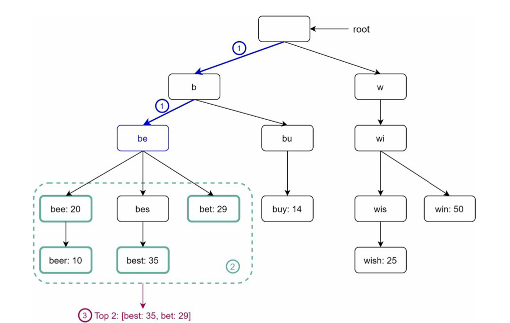

## :pushpin: 가상 면접 사례로 배우는 대규모 시스템 설계 기초
## :seedling: 13장. 검색어 자동 완성 시스템 설계

## 1단계: 문제 이해 및 설계 범위 설정
### 요구사항
- 빠른 응답 속도
- 연관성
- 정렬
- 규모 확장성
- 고가용성


## 2단계: 개략적인 설계안 제시
### 데이터 수집 서비스
- 질의가 들어올 때마다 키-값 스토어에 질의와 빈도를 저장하는 빈도 테이블 생성


질의 서비스
```sql
SELECT * FROM frequence_table WHERE query LIKE 'prefix%' ORDER BY frequency DESC LIMIT 5;
```

- 검색어와 검색어의 빈도를 저장하는 테이블이 만들어져 있다면 빈도가 가장 높은 5개의 단어가 자동완성으로 제공
- 데이터의 양이 적을 때는 나쁘지 않지만 데이터가 많아지면 병목 현상이 생길 수 있음


## 3단계: 상세설계
### 트라이 자료구조
- 트라이는 문자열을 찾기 위해 사용되는 자료 구조 중 하나
  - 트리 형태
  - 루트 노드는 빈 문자열을 나타냄
  - 각 노드는 글자 하나를 저장
  - 자식 노드로 해당 글자 다음에 등장할 모든 글자를 저장하는 노드를 가질 수 있다 (26개 노드)
  - 각 트리 노드는 하나의 단어, 또는 접두어의 문자열을 나타낸다.


- p: 접두어의 길이
- n: 트라이 안에 있는 노드 개수
- c: 주어진 노드의 자식 개수



가장 많이 사용된 질의어 K개는 다음과 같이 찾을 수 있다.
1. 해당 접두어를 표현하는 노드를 찾는다. -> O(p)
2. 해당 노드부터 시작하는 하위 트리를 탐색하며 모든 유효 노드를 찾는다. (유효한 검색 문자열을 구성하는 노드가 유효 노드다) -> O(c)
3. 유효 노드를 정렬하여 가장 인기있는 검색어 k개를 찾는다. -> O(c log c)

총 시간 복잡도는 O(p) + O(c) + O(c log c) = O(c log c)

최악의 경우 k개를 얻기 위해 모든 트리를 다 검색해야 하므로 다음 두 방법으로 해결
- 접두어의 최대 길이 제한
- 노드에 인기 검색어 캐시

### 질의 서비스
- 개략적 설계안에서 살펴본 질의 서비스는 데이터베이스를 활용하여 최고 인기 검색어 다섯 개를 골라냈다.
- 아래 그림은 해당 설계안의 비효율성을 개선한 새 설계안이다.


1. 검색 길의가 로드밸런서로 전송된다.
2. 로드밸런서는 해당 질의를 API 서버로 보낸다.
3. API 서버는 트라이 캐시에서 데이터를 가져와 해당 요청에 대한 자동완성 검색어 제안 응답을 구성한다.
4. 데이터가 트라이 캐시에 없는 경우에는 데이터를 데이터베이스에서 가져와 캐시에 채운다. 그래야 다음에 같은 
접두어에 대한 질의가 오면 캐시에 보관된 데이터를 사용해 처리할 수 있다. 캐시 미스는 캐시 서버의 메모리가 부족하거나
캐시 서버에 장애가 있어도 발생할 수 있다. 
