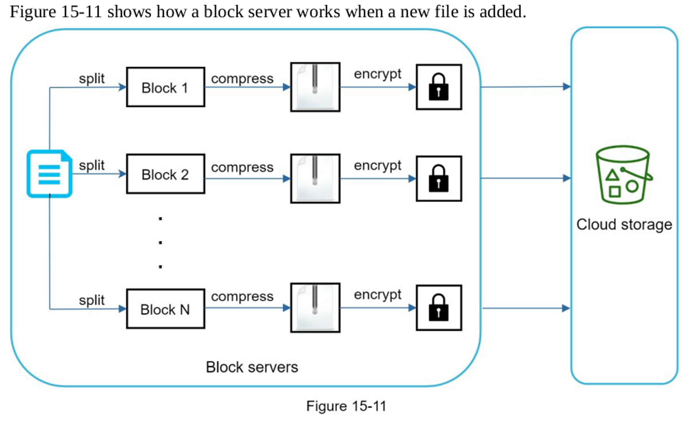
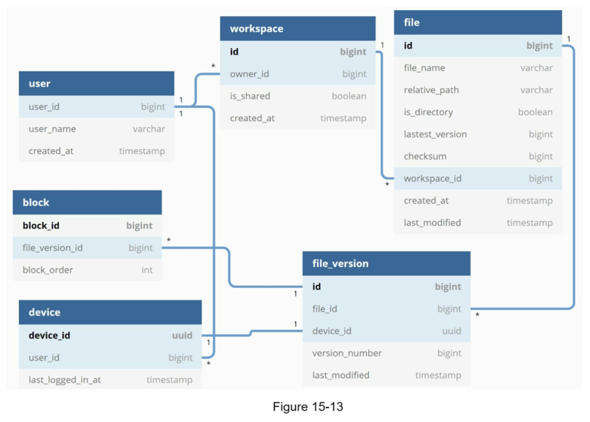

## :pushpin: 가상 면접 사례로 배우는 대규모 시스템 설계 기초
## :seedling: 15장. 구글 드라이브 설계

구글 드라이브는 파일 저장 및 동기화 서비스로 문서, 사진, 비디오, 기타 파일을 클라우드에 보관할 수 있도록 한다.
이 파일은 컴퓨터, 스마트폰, 태블릿 등 어떤 단말에서도 이용 가능해야 한다.

## 개략적 설계안 제시 및 동의 구하기

- 사용자 단말: 사용자가 이용하는 웹브라우저나 모바일 앱 등의 클라이언트
- 블록 저장소 서버: 파일 블록을 클라우드 저장소에 업로드하는 서버. 블록 저장소는 블록 수준 저장소라고도 하며 클라우드 환경에서 데이터 파일을 저장하는 기술
- 클라우드 저장소: 파일은 블록 단위로 나눠져 클라우드 저장소에 보관된다.
- 아카이빙 저장소: 오랫동안 사용되지 않은 비활성 데이터를 저장하기 위한 컴퓨터 시스템
- 로드밸런서: 요청을 모든 API 서버에 고르게 분산하는 구실
- API 서버: 파일 업로드 외에 거의 모든 것을 담당하는 서버
- 메타데이터 데이터베이스: 사용자, 파일, 블록, 버전 등의 메타데이터 정보를 관리한ㄷ.
- 메타데이터 캐시: 성능을 높이기 위해 자주 쓰이는 메타데이터는 캐시한다.
- 알림 서비스: 특정 이벤트가 발생했음을 클라이언트에게 알리는데 쓰이는 발생/구독 프로토콜 기반 시스템
- 오프라인 사용자 백업 큐: 클라이언트가 접속 중이 아니라서 파일의 최신상태를 확인할 수 없을 때는 해당 정보를 이 큐에 두어 나중에 클라이언트가 접속했을 때 동기화될 수 있도록 함 

### 상세 설계
블록 저장소 서버

- 델타 동기화: 파일이 수정되면 전체 파일 대신 수정이 일어난 블록만 동기화
- 압축: 블록 단위로 압축해두면 데이터 크기를 많이 줄일 수 있다. 

