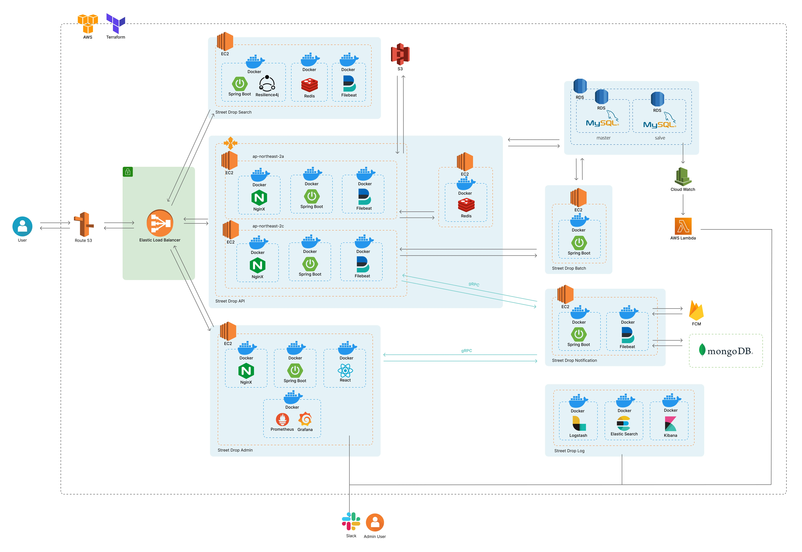

## 1주차 미션

---

## 웹 브라우저에서 www.naver.com을 입력하면 다음과 같은 과정이 발생한다.

1. URL 입력 및 브라우저 처리
   사용자가 브라우저 주소창에 www.naver.com을 입력하고 Enter를 누름.
   브라우저는 URL을 분석하여 http 또는 https 프로토콜을 확인.
   기본적으로 HTTPS가 사용되므로 https://www.naver.com 요청을 생성.
2. DNS 조회 (Domain Name System)
   브라우저는 **www.naver.com**을 IP 주소로 변환해야 함.
   로컬 DNS 캐시에서 www.naver.com의 IP 주소가 있는지 확인.
   없으면 운영체제(OS) → 로컬 네트워크 DNS 서버 → ISP(인터넷 서비스 제공업체) DNS 서버 → 최상위 DNS 서버까지 확인하며 IP 주소를 찾음.
   최종적으로 **NAVER의 웹 서버 IP 주소(예: 223.130.195.200)**를 얻음.
3. TCP 연결 및 TLS/SSL 핸드셰이크
   브라우저는 네이버 서버와 연결(TCP 3-way handshake):
   SYN: 클라이언트가 서버에 연결 요청 (SYN 패킷 전송).
   SYN-ACK: 서버가 요청을 수락 (SYN-ACK 응답).
   ACK: 클라이언트가 확인 응답 (ACK 전송).
   HTTPS 사용 시 TLS/SSL 핸드셰이크 수행
   네이버 서버의 SSL 인증서 확인 (유효성 검증).
   암호화된 보안 통신 채널 형성.
4. HTTP 요청 전송
   브라우저는 **네이버 서버로 HTTP 요청(예: GET 요청)**을 보냄
   요청에는 브라우저 유형, OS, 언어, 쿠키 등의 정보 포함.
5. 서버의 응답 및 웹 페이지 전송
   네이버의 **웹 서버(Apache, Nginx 등)**가 요청을 처리하고 응답을 반환:
   HTML, CSS, JavaScript, 이미지 등 웹페이지의 콘텐츠가 포함됨.
6. 브라우저의 렌더링 과정
   브라우저는 응답을 받은 후 다음 단계를 수행:
   HTML 파싱: HTML 문서를 분석하여 DOM(Document Object Model) 생성.
   CSS 적용: 스타일을 분석하여 렌더링 트리(Rendering Tree) 구성.
   JavaScript 실행: 동적 콘텐츠 로드 및 페이지 인터랙션 적용.
   이미지, 동영상 등 로드: 추가적인 리소스를 비동기적으로 다운로드.
   레이아웃 및 화면 그리기(Painting): 화면에 최종적으로 렌더링.
7. 사용자 인터랙션 및 추가 요청
   사용자는 페이지를 탐색하며 추가적인 요청을 보낼 수 있음.
   브라우저는 필요 시 AJAX 요청 또는 비동기 JavaScript 실행 등을 통해 추가 데이터를 요청.
   

### 정리
1. 사용자가 www.naver.com 입력
2. DNS 조회로 IP 주소 확인
3. TCP 연결 및 TLS/SSL 핸드셰이크 수행
4. HTTP 요청 전송
5. 서버가 HTML 및 리소스 응답
6. 브라우저가 페이지를 렌더링
7. 추가적인 데이터 요청 및 사용자 상호작용 발생
   

### 서비스 아키텍처 (Street Drop)

