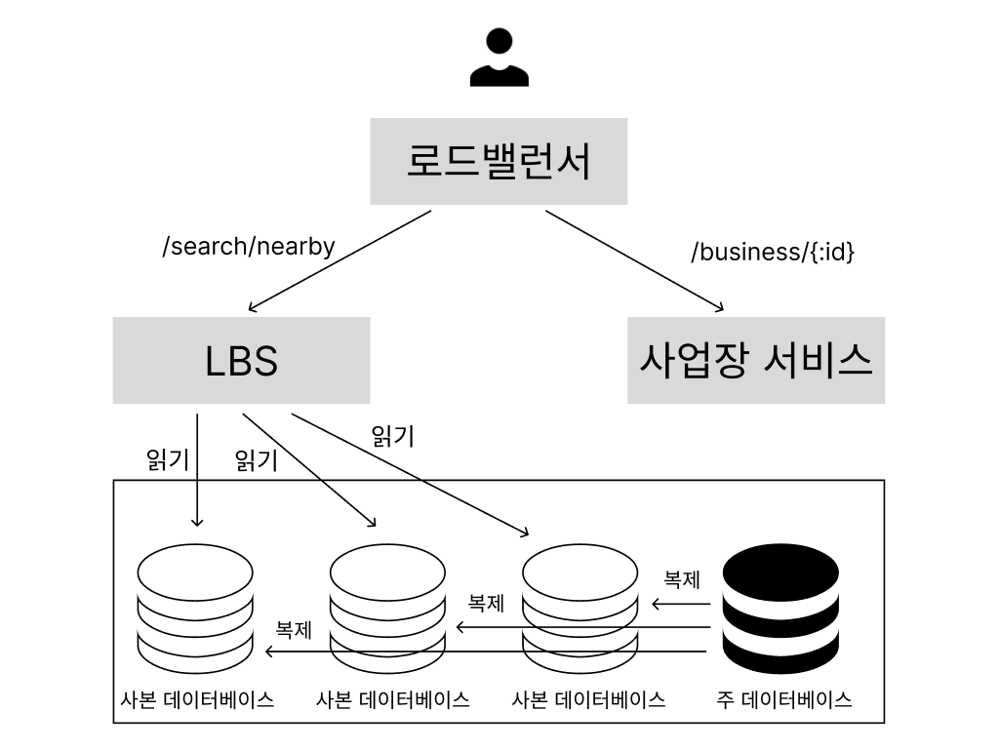
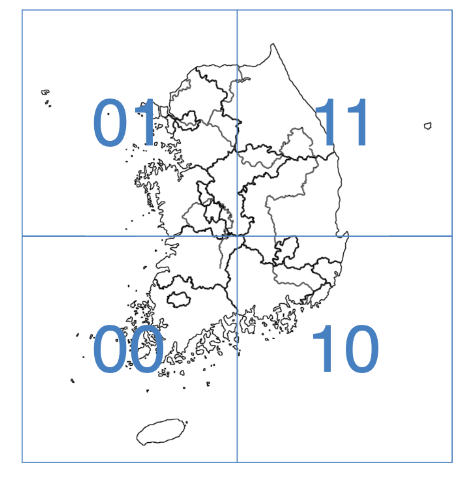
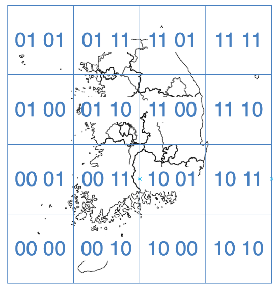
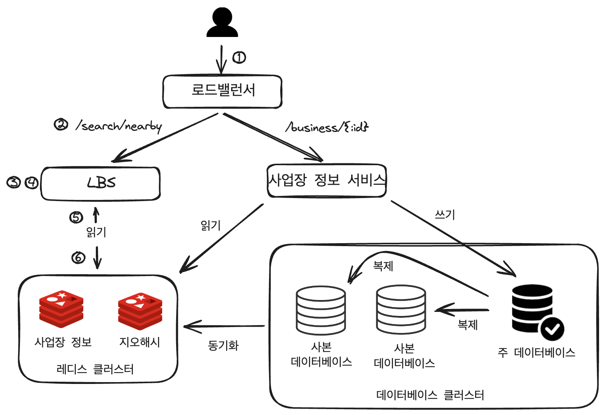

## :pushpin: 가상 면접 사례로 배우는 대규모 시스템 설계 기초 2권
## :seedling: 1장. 근접성 서비스

> 근접성 서비스는 음식점, 호텔, 극장, 박물관 등 현재 위치에서 가까운 시설을 찾는데 이용된다.
> 옐프(Yelp) 앱의 경우에는 주변에 있는 좋은 식당 검색, 구글 맵의 경우에는 가까운 k개 주유소 검색 등의 기능 구현에 이용된다.


## 1단계: 문제 이해 및 설계 범위 확정

기능 요구사항
- 사용자의 위치(경도와 위도 쌍)와 검색 반경 정보에 매치되는 사업장 목록을 반환
- 사업장 소유주가 사업장 정보를 추가, 삭제, 갱신할 수 있도록 하되 그 정보가 검색 결과에 실시간으로 반영될 필요는 없다고 가정
- 고객은 사업장의 상세 정보를 살필 수 있어야 함

비기능 요구사항
- 낮은 응답 지연
- 데이터 보호
- 고가용성 및 규모 확장성 요구사항


## 2단계: 개략적 설계안 제시 및 동의 구하기
1. API 설계
2. 개략적 설계안
3. 주변 사업장 검색 알고리즘
4. 데이터 모델

### 2-1. API 설계

> GET /v1/search/nearby

- 이 API는 특정 검색 기준에 맞는 사업장 목록을 반환
- 검색 결과는 보통 페이지 단위로 반환

인자

|필드|설명|자료형|
|---|---|---|
|latitude|검색할 위도|decimal|
|longitude|검색할 경도|decimal|
|radius|선택적 인자. 생략할 경우 기본값은 5000m|int|

반환되는 결과
```text
{
    "total": 10,
    "business": [{business object}]
}
```

사업장 관련 API

| API | 설명 |
| --- | --- |
| GET /v1/business/:id | 특정 사업장의 상세 정보 반환 |
| POST /v1/business | 새로운 사업장 추가 |
| PUT /v1/business/:id | 사업장 상세 정보 갱신 |
| DELETE /v1/business/:id | 특정 사업장 정보 삭제 |


### 데이터 모델

business 테이블은 사업장 상세 정보를 담는다.

```text
business_id. PK
address
city
state
country
latitude
longtitude
```

지리적 위치 색인 테이블 


### 개략적 설계 
이 시스템은 위치 기반 서비스 (location-based service, LBS)와 사업장 관련 서비스 두 부분으로 구성됨


- 로드밸런서: 유입 트래픽을 자동으로 여러 서비스에 분산시키는 컴포넌트
- 위치 기반 서비스(LBS): 주어진 위치와 반경 정보를 이용해 주변 사업장을 검색한다.
- 사업장 서비스: 사업장 소유주가 사업장 정보를 생성, 갱신, 삭제한다. 고객이 사업장 정보를 조회한다.


#### 데이터베이스 클러스터
- 데이터베이스 클러스터는 주-부(primary-secondary) 데이터베이스 형태도 구성할 수 있음
- 주 데이터베이스는 쓰기 요청을 처리
- 부 데이터베이스, 즉 사본 데이터베이스는 읽기 요청을 처리


#### 주변 사업장 검색 알고리즘
실제로는 많은 회사가 레디스 지오해시나 PostGIS 확장을 설치한 포스트그레스(Postgres) 데이터베이스를 활용

방안 1. 2차원 검색
- 주어진 반경으로 그린 원 안에 놓인 사업장을 검색하는 방법
- 가장 직관적이지만 지나치게 단순

```sql
SELECT business_id, latitude, longitude
FROM business
WHERE (latitude BETWEEN {:my_lat} - radius AND {:my_lat} + radius)
  AND (longitude BETWEEN {:my_long} - radius AND {:my_long} + radius)
```

지리적 색인을 만드는 방법
- 해시 기반 방안: 균등 격자, 지오 해시, 카르테시안 계층
- 트리 기반 방안: 쿼드트리, 구글 S2, R 트리 등

- 각 색인법의 구현 방법은 다르지만 개략적 아이디어는 같다. 즉 지도를 작은 영역으로 분할하고 고속 검색이 가능하도록 색인을 만드는 것

방안 2. 균등 격자
- 지도를 작은 격자 또는 구획으로 나누는 단순한 접근법
- 사업장 분포가 균등하지 않다는 문제점이 있다.


방안 3. 지오해시 (GeoHash)
- 2차원의 위도 경도 데이터를 1차원의 문자열로 변환
- 지오해시 알고리즘은 비트를 하나씩 늘려가면서 재귀적으로 세계를 더 작은 격자로 분할해나간다.



```text
구글 본사 지오해시: 1001 11010 01001 10001 11111 11110 (base32 이진 표기), 9q9hvu (base32)
페이스북 본사 지오해시: 1001 11010 01001 10011 10001 11011 (base32 이진 표기), 9q9jhr (base32)
```

격자 가장자리 이슈: 두 지점이 적도의 다른 쪽에 놓이거나 자오선상의 다른 반쪽에 놓이는 경우


방안 4. 쿼드트리
- 쿼드트리는 메모리 안에 놓이는 자료구조일뿐 데이터베이스가 아니라는 것에 유의하자. 
- 이 자료구조는 각각의 LBS 서버에 존재해야 하며 서버가 시작되는 시점에 구축된다.
- 이 트리의 루트 노드는 세계 전체 지도를 나타낸다.
- 이 루트 노드를 사분면 각각을 나타내는 하위 노드로, 어떤 노드의 사업장도 100개를 넘지 않을때까지 재귀적으로 분할

방안 5. 구글 S2
- 구글 S2 기하 라이브러리는 이 분야에서 아주 유명한 솔루션
- 메모리 기반


### 지오해시 vs 쿼드트리
지오해시
- 구현과 사용이 쉽다. 트리를 구축할 필요가 없다.
- 지정 반경 이내 사업장 검색을 지원한다.
- 색인 갱신이 쉽다.
- 인구 밀도에 따라 동적으로 격자 크기를 조정할 수는 없다.

쿼드트리
- 구현하기가 살짝 더 까다롭다. 트리 구축이 필요해서다.
- k번째로 가까운 사업장까지의 목록을 구할 수 있다.
- 인구 밀도에 따라 격자 크기를 동적으로 조정할 수 있다.
- 지오해시보다 색인 갱신은 까다롭다. 사업장 정보를 삭제하려면 루트 노드부터 말단 노드까지 트리를 순회해야 한다.


## 3단계: 상세 설계


주변 사업장 검색
1. 주변 반경 500미터 내 모든 식당을 찾는 경우를 생각해보자. 우선 클라이언트 앱은 사용자의 위치(위도, 경도)와 검색 반경을 로드밸런서로 전송한다.
2. 로드밸런서는 해당 요청을 LBS로 보낸다.
3. 주어진 사용자 위치와 반경 정보에 의거하여 LBS는 검색 요건을 만족할 지오해시 길이를 계산한다.
4. LBS는 인접한 지오해시를 계산한 다음 목록에 추가한다.
5. list_of_geohashes 내에 있는 지오해시 각각에 대해 LBS는 지오해시 레디스 서버를 호출하여 해당 지오해시에 대응하는 모든 사업장 ID를 추출한다.
지오해시별로 사업장 ID 목록을 가져오는 연산을 병렬적으로 수행하면 검색 결과를 내는 지연시간을 줄일 수 있다.
6. 반환된 사업장 ID들을 가지고 사업장 정보 레디스 서버를 조회하여 각 사업장의 상세 정보를 취득한다. 해당 상세 정보에 의거하여 사업장과 사용자 간 거리를 확실하게 계산하고 우선순위를 매긴다음 클라이언트 앱에 반환한다.

사업장 정보 조회, 갱신, 추가 그리고 삭제
1. 모든 사업장 정보 관련 API는 LBS와는 분리한다. 


## 4단계: 마무리
- IT 기업에서 널리 쓰이는 기술은 지오해시, 쿼드트리, 그리고 S2이다.