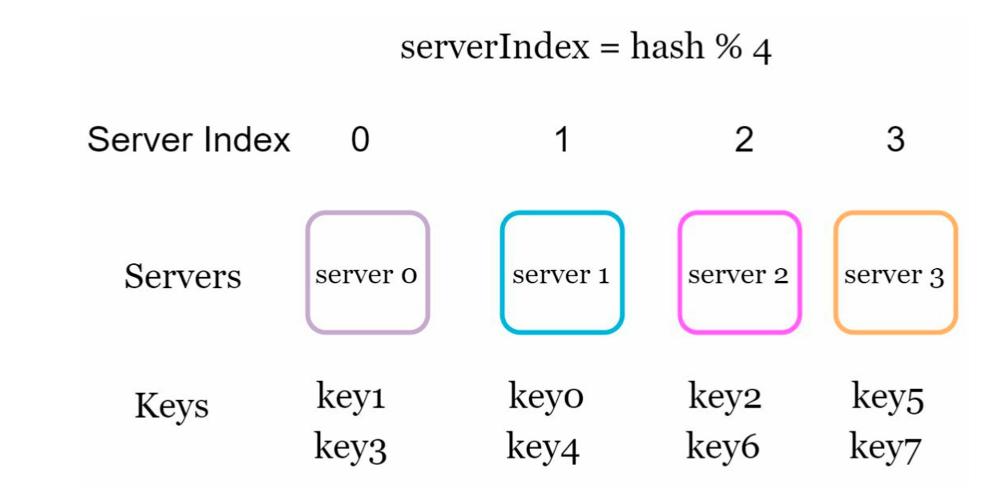
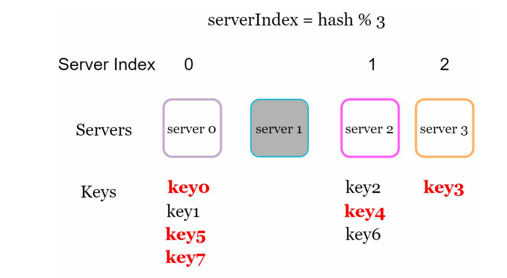
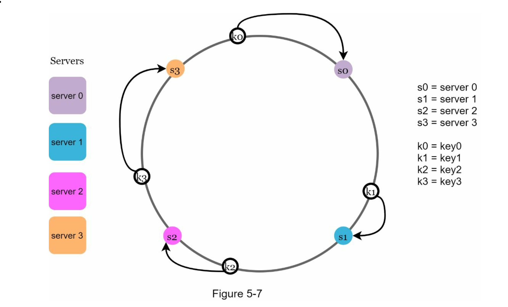
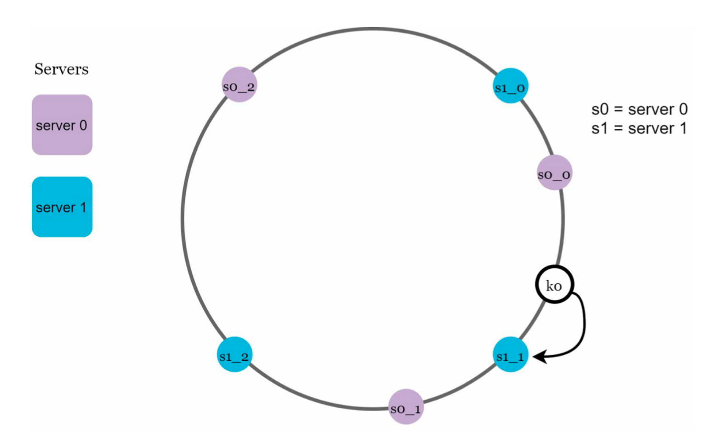

# :pushpin: 5장. 안정 해시 설계


## 안정 해시 설계
- 수평적 규모 확장성을 달성하기 위해서는 요청 또는 데이터를 서버에 균등하게 나누는 것이 중요.
- 안정 해시는 이 목표를 달성하기 위해 보편적으로 사용되는 기술


## 해시 키 재배치(rehash) 문제
- N개의 캐시 서버가 있다고 하자
- 이 서버들에 부하를 균등하게 나누는 보편적인 방법은 아래의 해시 함수를 사용하는 것

```text
serverIndex = hash(key) % N (N은 서버의 개수)
```



- 특정한 키가 보관된 서버를 알아내기 위해 나머지(modular) 연산을 `f(key) % 4` 와 같이 적용하였다.
- 예를 들어 `hash(key0) % 4 = 1 이면 클라이언트는 캐시에 보관된 데이터를 가져오기 위해 서버 1에 접속해야 한다.
- 이 방법은 서버 풀(server pool)의 크기가 고정되어 있고 데이터 분포가 균등할 때는 잘 동작한다.
- 하지만 서버가 추가되거나 기존 서버가 삭제되면 문제가 생긴다.


- 1번 서버에 장애가 발생하면 1번 서버에 보관되어 있는 키뿐만 아니라 대부분의 키가 재분배됨
- 그 결과로 대규모 캐시 미스(cache miss)가 발생하게 된다.
- 안정 해시는 이 문제를 효과적으로 해결할 수 있다.


## 안정 해시
- 안정 해시(consistent hash)는 해시 테이블 크기가 조정될때 평균적으로 오직 k/n개의 키만 재배치하는 해시 기술 (위키피디아)
- 여기서 k는 키의 개수, n은 슬롯(slot)의 개수다.




- 해시 함수로 SHA-1을 사용한다고 하고 그 함수의 출력값 범위는 x0, x1, x2, x3, ..., xn과 같다고 하자.
- SHA-1의 해시 공간 범위는 0부터 2의 160승 -1 
- 따라서 x0는 0, xn은 2의 160승 - 1 
- 이 해시 공간의 양쪽을 구부려 접으면 해시 링(hash ring)이 만들어진다.

### 해시 서버
- 이 해시 함수 f를 사용하면 서버 IP나 이름을 이 링 위의 어떤 위치에 대응시킬 수 있다.

### 해시 키
- 여기서 나머지 연산 %는 사용하지 않고 있다.
- 캐시할 키 key0, key1, key2, key3 또한 해시 링 위의 어느 지점에 배치할 수 있다.

### 서버 조회
- 어떤 키가 저장되는 서버는 해당 키의 위치로부터 시계 방향으로 링을 탐색해나가면서 만나는 첫번째 서버이다.
- 따라서 key0은 서버0에 저장되고 key1은 서버1에 저장되며 key2는 서버2, key3은 서버3에 저장된다.

### 서버 추가
- 해시 링은 서버를 추가하더라도 키 가운데 일부만 재배치하면 된다.
- 위 그림을 보면 새로운 서버 4가 추가된 뒤에 key0만 재배치됨을 알 수 있다. k1, k2, k3은 같은 서버에 남는다.

## 서버 제거
- 하나의 서버가 제거되면 키 가운데 일부만 재배치된다. 


### 기본 구현법의 두가지 문제
- 서버가 추가되거나 삭제되는 상황을 감안하면 파티션(partition)의 크기를 균등하게 유지하는 것이 불가능하다. 여기서 파티션은 인접한 서버 사이의 해시 공간이다.
- 두번째 문제는 키의 균등 분포를 달성하기 어렵다는 것이다.
- 이 문제를 해결하기 위해 제안된 기법이 가상 노드 또는 복제라 불리는 기법이다.


## 가상 노드
가상 노드는 실제 노드 또는 서버를 가리키는 노드로서, 하나의 서버는 링 위에 여러 개의 가상 노드를 가질 수 있다.



- 키의 위치로부터 시게 방향으로 링을 탐색하다 만나는 최초의 가상 노드가 해당 키가 저장될 서버가 된다. 
- 가상 노드의 개수를 늘리면 키의 분포는 점점 더 균등해진다.
- 그러나 가상 노드 데이터를 저장할 공간은 더 많이 필요하게 된다.

### 재배치할 키 결정
- 서버가 추가되거나 제거되면 데이터 일부는 재배치해야 한다.


## 마치며
- 안정 해시의 이점은 다음과 같다.
    - 서버가 추가되거나 삭제될 때 재배치되는 키의 수가 최소화
    - 데이터가 보다 균등하게 분포하게 되므로 수평적 규모 확장성을 달성하기 쉽다.
    - 핫스팟(hotspot) 키 문제를 줄인다. 특정한 샤드(shard)에 대한 접근이 지나치게 빈번하면 서버 과부하 문제가 생길 수 있다.
- 안정 해시는 실제로 널리 쓰이는 기술이다. 그 중 중요한 몇 가지를 예로 들면 아래와 같다.
  - 아마존 다이나모 데이터베이스의 파티셔닝 관련 컴포넌트
  - 아파치 카산드라 클러스터에서의 데이터 파티셔닝
  - 디스코드 채팅 애플리케이션
  - 아카마이 CDN
  - 매그레프 네트워크 부하 분산기