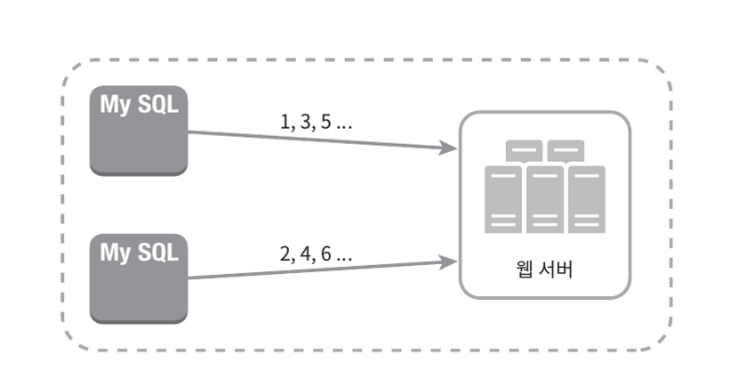

# :pushpin: 7장. 분산 시스템을 위한 유일 ID 생성기 설계
분산 시스템에서 사용될 유일 ID 생성기를 설계해보자.

## 2단계: 개략적 설계안 제시 및 동의 구하기
분산 시스템에서 유일성이 보장되는 ID를 만드는 방법은 여러가지다.
- 다중 마스터 복제 (multi-master replication)
- UUID (Universally Unique Identifier)
- 티켓 서버 (ticket server)
- 트위터 스노플레이크 접근법

### 다중 마스터 복제

- 이 접근법은 데이터베이스의 auto_increment 기능을 활용하는 것이다.
- 다만 다음 ID의 값을 구할 때 1만큼 증가시켜 얻는 것이 아니라 k만큼 증가시킨다.
- 여기서 k는 현재 사용 중인 데이터베이스 서버의 수다.

### UUID
- UUID는 유일성이 보장되는 ID를 만드는 또 하나의 간단한 방법
- UUID는 컴퓨터 시스템에 저장되는 정보를 유일하게 식별하기 위한 128비트짜리 수다.
- UUID 값은 충돌 가능성이 지극히 낮다.
- UUID는 서버 간 조율없이 독립적으로 생성 가능하다.

### 티켓 서버

- 티켓 서버는 유일성이 보장되는 ID를 만들어내는데 쓰일 수 있는 또 하나의 방법
- auto_increment 기능을 갖춘 데이터베이스 서버, 즉 티켓 서버를 중앙 집중형으로 하나만 사용하는 것

### 트위터 스노플레이크 접근법

- 트위터는 스노플레이크라고 부르는 독창적인 ID 생성 기법을 사용한다.
  - 사인 비트
  - 타임스탬프
  - 데이터센터 ID
  - 서버 ID
  - 일련번호