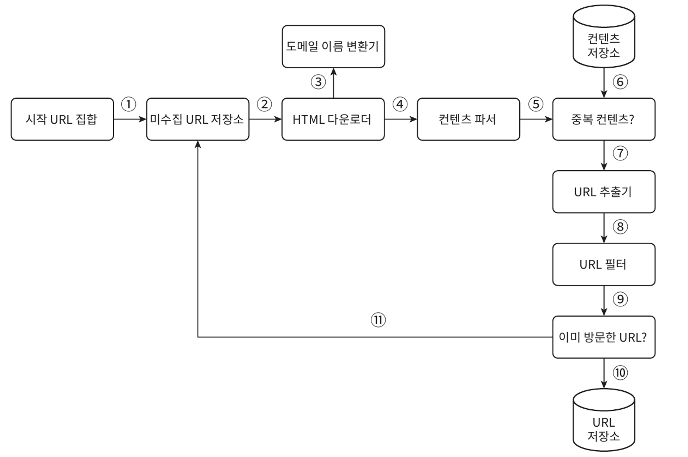
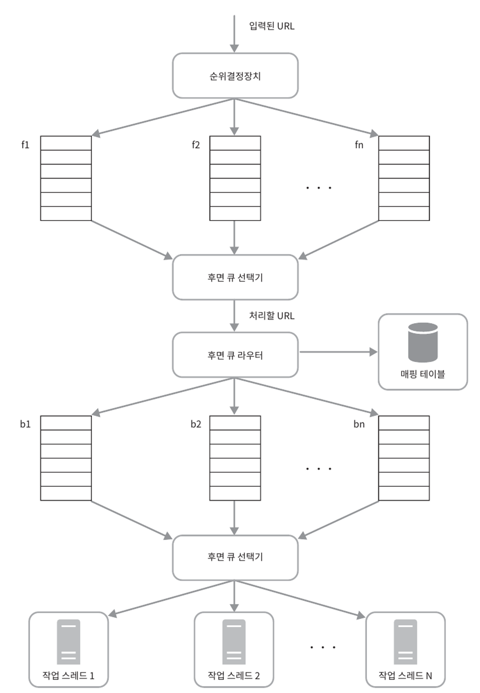
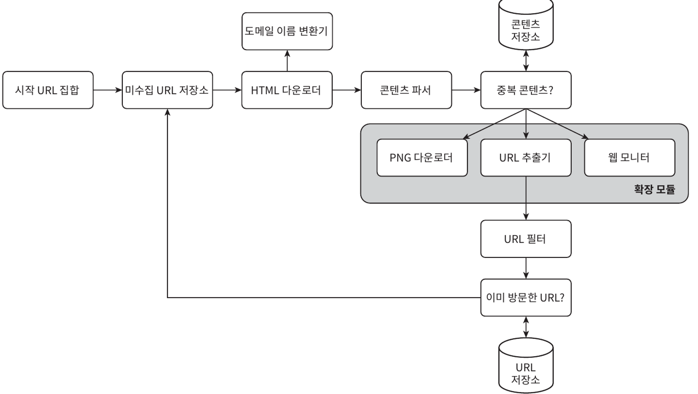

# :pushpin: 9장 웹 크롤러 설계

웹 크롤러는 로봇 또는 스파이더라고도 부른다. 검색 엔진에서 널리 쓰는 기술로 웹에 새로 올라오거나 갱신된 콘텐츠를 찾아내는 것이 주된 목적이다.

웹 크롤러는 몇 개 웹페이지에서 시작하여 그 링크를 따라 나가면서 새로운 콘텐츠를 수집한다.

## 1단계: 문제 이해 및 설계 범위 확정
웹 크롤러의 기본 알고리즘

1. URL 집합이 입력으로 주어지면 해당 URL들이 가리키는 모든 웹 페이지를 다운로드한다.
2. 다운받은 웹 페이지에서 URL들을 추출한다.
3. 추출된 URL들을 다운로드할 URL 목록에 추가하고 위의 과정을 처음부터 반복한다.

## 2단계 개략적 설계안 제시 및 동의 구하기

- 시작 URL 집합 : 웹크롤러가 크롤링을 하는 시작점
- 미수집 URL 저장소 : 다운로드할 URL을 저장관리하는 컴포넌트 (FIFO Queue)
- HTML 다운로더 : 웹 페이지를 다운로드하는 컴포넌트
- 도메인 이름 변환기 : URL을 IP 주소로 변환하여 웹페이지 다운로드
- 컨텐츠 파서 : 웹페이지를 다운로드하면서 파싱과 검증 절차를 가져야 함(크롤링 서버 안에 콘텐츠 파서를 구현하면 크롤링 과정이 느리게 되므로 별도 컴포넌트로 구현)
- 중복 컨텐츠 : 이미 시스템에 저장된 컨텐츠인지 확인 (효과적인 방법은 웹페이지의 해시 값을 비교하는 것)
- 콘텐츠 저장소 : HTML 문서를 보관하는 시스템으로 대부분의 콘텐츠는 디스크, 인기 있는 콘텐츠는 메모리에 두어 지연 시간을 줄임
- URL 추출기 : HTML 페이지를 파싱하여 링크들을 골라내는 역할, 상대 경로는 절대경로로 변환
- URL 필터 : 특정 콘텐츠 타입이나 파일 확장자를 갖는 URL, 접속시 오류가 발생하는 URL, 접근 제외 목록에 포함된 URL 등을 크롤링 대상에서 배제하는 역할
- 이미 방문한 URL : 이미 방문한 적이 있는 URL인지 추적하여 중복 처리 방지, 서버 부하 감소, 무한 루프 방지
- URL 저장소 : 이미 방문한 URL을 보관하는 저장소

이제 이 컴포넌들이 상호 연동하는 과정을 작업 흐름 관점에서 살펴보자.

1. 시작 URL 들을 미수집 URL 저장소에 저장한다.
2. HTML 다운로더는 미수집 URL 저장소에서 URL 목록을 가져온다.
3. HTML 다운로더는 도메인 이름 변환기를 사용하여 URL의 IP주소를 알아내고 해당 IP주소로 접속하여 웹 페이지를 다운받는다.
4. 콘텐츠 파서는 다운된 HTML 페이지를 파싱하여 올바른 형식을 갖춘 페이지인지 검증한다.
5. 콘텐츠 파싱과 검증이 끝나면 중복 콘텐츠인지 확인하는 절차를 개시한다.
6. 중복 콘텐츠인지 확인하기 위해서 해당 페이지가 이미 저장소에 있는지 본다.
7. 이미 저장소에 있는 콘텐츠인 경우에는 처리하지 않고 버린다.
8. 저장소에 없는 콘텐츠인 경우에는 저장소에 저장한 뒤 URL 추출기로 전달한다.
9. URL 추출기는 해당 HTML 페이지에서 링크를 골라낸다.
10. 골라낸 링크를 URL 필터로 전달한다.
11. 필터링이 끝나고 남은 URL만 중복 URL 판별 단계로 전달한다.
12. 이미 처리한 URL인지 확인하기 위하여 URL 저장소에 보관된 URL인지 살핀다. 이미 저장소에 있는 URL은 버린다.
13. 저장소에 없는 URL은 URL 저장소에 저장할 뿐 아니라 미수집 URL 저장소에도 전달한다.

## 3단계: 상세 설계

- DFS(Depth-First Search) vs BFS (Breath-First Search)
- 미수집 URL 저장소
- HTML 다운로더
- 안정성 확보 전략
- 확장성 확보 전략
- 문제 있는 콘텐츠 감지 및 회피 전략

### DFS VS BFS
- 웹의 페이지는 노드이고, 하이퍼링크(URL)는 에지(edge)인 유향 그래프
  - DFS (부적합) : 웹의 node 깊이가 어느 정도로 깊숙이 가게 될지 가늠하기 어려움
  - BFS 
    - 특정 페이지에서 나오는 링크는 보통 동일한 도메인을 가지므로 병렬 처리시 수 많은 요청을 보내 과부하에 걸릴 수 있음 (예의 없는 크롤러)
    - 표준 BFS 알고리즘을 사용하면 URL 간에 우선순위를 두지 않는 문제
    - 페이지 순위, 사용자 트래픽 양, 업데이트 빈도 등 여러가지 척도에 기반해 처리 우선순위를 구별해야함
    - 미수집 URL 저장소
    - 아무 우선순위 처리가 없는 크롤러는 동일한 서버로 너무 많은 요청을 보낼 수 있음(impolite)

- 예의바른 크롤러 : 동일 웹사이트에 대해서는 한번에 한페이지만 요청을 보내는 것을 원칙으로 한다
  - 큐 라우터: 같은 호스트에 속한 URL 은 언제나 같은 큐로 가도록 보장
  - 매핑 테이블: 호스트 이름과 큐 사이의 관계를 보관하는 테이블
  - 큐 선택기: 큐에서 URL 을 거내서 해당 큐에서 나온 URL 을 다운로드 하도록 --> 작업 스레드에 전달
  - 작업스레드: 전달된 URL 다운로드 작업, 지연 시간 가능

#### 우선순위 
- 유용성에 따라 페이지 랭크, 트래픽 양, 갱신 빈도 등 다양한 척도 사용해 URL 을 나눌 필요가 있다.
- 전면 큐: 우선순위 결정 과정 처리
- 후면 큐: 크롤러가 Politeness 하게 동작하도록 보증
- 신선도
  - 웹 페이지의 변경 이력(update history) 활용
- 우선순위를 활용하여, 중요한 페이지는 좀 더 자주 재수집

#### 성능 최적화
- 분산 크롤링 : 크롤링 작업을 여러 서버에 분산하는 방식
- DNS cache : DNS 자체에 들리는 시간을 줄이기 위해 DNS 조회 결과로 얻어진 도메인 이름과 IP 주소의 매핑 정보를 내부 시스템에 캐싱하는 것
- 지역성 : 크롤링 작업을 수행하는 서버를 지역별로 분산하는 방식
- 짧은 타임아웃 : 웹의 응답이 느리거나 아예 없는 경우를 대비하기 위해 timeout 시간을 짧게 가져간다
- 확장성 : 시스템은 진화하기 때문에 새로운 형태의 콘텐츠를 쉽게 지원할 수 있도록 해야함

#### 문제 있는 컨텐츠 감지 및 회피
- 중복 컨텐츠 : 웹 콘텐츠의 30% 가량은 중복이니, 해시나 체크섬을 사용하여 중복 콘텐츠를 쉽게 탐지한다
- 거미 덫 : 모든 종류의 크롤링 덫을 피할 수는 없다. 한 가지 옵션으로는 사람이 수작업으로 덫을 확인하고 찾아낸 후에 덫이 있는 사이트를 크롤러 탐색 대상에서 제외하거나 URL 필터 목록에 걸어두는 것이다
- 데이터 노이즈 : 광고나 스팸 URL, 스크립트 코드 같은 콘텐츠는 가치가 없으므로 가능하면 제외해야 한다

#### 마무리
추가로 논의해볼 것은 아래와 같다.
- 서버 측 렌더링
- 원치 않는 페이지 필터링
- 데이터베이스 다중화 및 샤딩
- 수평적 규모 확장성
- 가용성, 일관성, 안정성
- 데이터 분석 솔루션