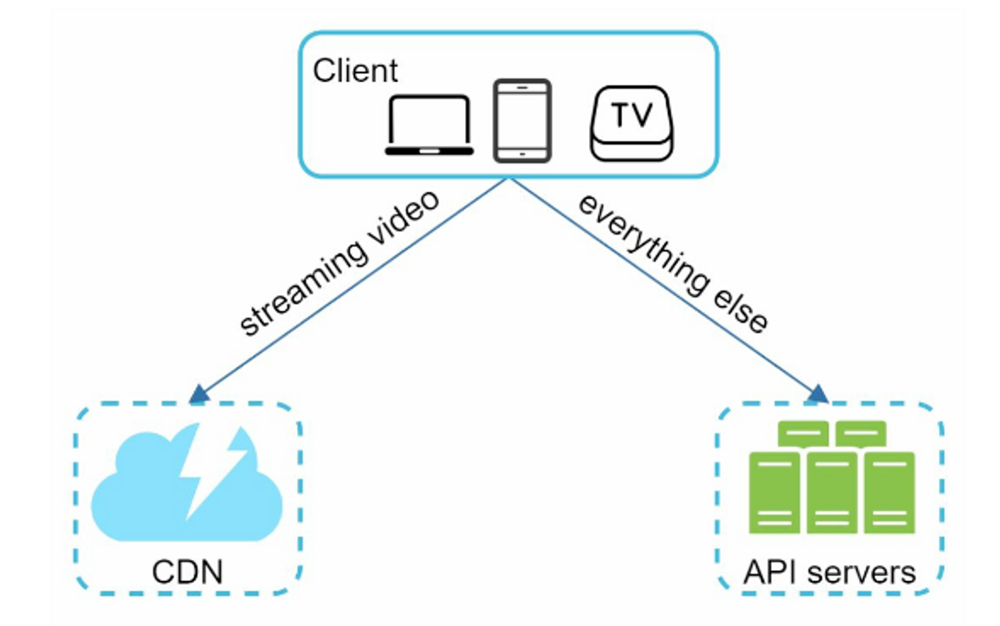
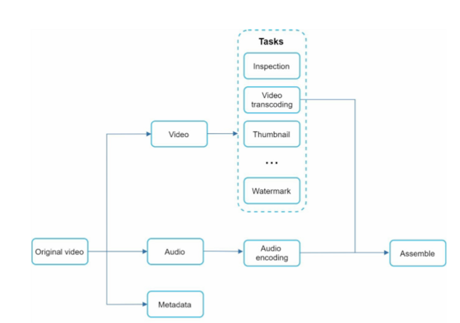

## :pushpin: 가상 면접 사례로 배우는 대규모 시스템 설계 기초
## :seedling: 14장. 유튜브 설계

## 1단계: 문제 이해 및 설계 범위 확정
### 요구사항
- 빠른 비디오 업로드
- 원활한 비디오 재생
- 재생 품질 선택 기능
- 낮은 인프라 비용
- 높은 가용성과 규모 확장성 및 안정성
- 지원 클라이언트: 모바일 앱, 웹 브라우저, 스마트 TV

- Client: 컴퓨터, 휴대폰, 스마트 TV 등
- CDN: 비디오는 CDN에 저장되고, 재생버튼을 누를때 CDN에서 영상이 스트리밍된다.
- AP Server: 영상 재생을 제외한 모든 것들을 API 서버에서 처리

### 비디오 업로드

프로세스 a: 비디오 업로드
1. 비디오를 원본 저장소에 업로드한다.
2. 트랜스코딩 서버는 원본 저장소에서 해당 비디오를 가져와 트랜스코딩을 시작한다.
3. 트랜스코딩이 완료되면 아래 두 절차가 병렬적으로 수행된다.  
   1. 완료된 비디오를 트랜스코딩 비디오 저장소로 업로드한다.
   2. 트랜스코딩 완료 이벤트를 트랜스코딩 완료 큐에 넣는다.
   3. 트랜스코딩이 끝난 비디오를 CDN에 올린다.
   4. 완료 핸들러가 이벤트 데이터를 큐에서 꺼낸다.
   5. 완료 핸들러가 메타데이터 데이터베이스와 캐시를 갱신한다.
4. API 서버가 단말에게 비디오 업로드가 끝나서 스트리밍 준비가 되었음을 알린다.

프로세스 b: 메타데이터 갱신
원본 저장소에 파일이 업로드되는동안, 단말은 병렬적으로 비디오 메타데이터 갱신 요청을 API 서버에 보낸다. 
이 요청에 포함된 메타데이터에는 파일이름, 크기, 포맷 등의 정보가 들어있다.
API 서버는 이 정보로 메타데이터 캐시와 데이터베이스를 업데이트한다.

- 스트리밍은 사용자의 장치가 원격지의 비디오로부터 지속적으로 비디오 스트림을 전송받아 영상을 재생하는 것을 말한다.
- 스트리밍 프로토콜은 비디오 스트리밍을 위해 데이터를 전송할 때 쓰이는 표준화된 통신방법
- 대표적인 것은 아래와 같다.
  - MPEG-DASH
  - Apple HLS
  - Microsoft Smooth Streaming
  - Adobe HTTP Dynamic Streaming(HDS)

## 상세설계
- 비디오 트랜스코딩
  - 업로드된 비디오가 다른 만달에서 순조롭게 재생되려면 다른 단말과 호환되는 비트레이트와 포맷으로 저장되어야 함
  - 영상 인코딩 포맷
    - Container: 영상파일, 음성파일, Metadata를 보관 (.avi, .mp4 등)
    - Codecs: 영상 퀄리티를 유지하면서 영상 사이즈를 줄일 수 있게 하는 압축 알고리즘 (HEVC, VP9, H.264 등)
  

### Directed acyclic graph (DAG) 모델

- 영상 제작자에 따라 여러 요구사항이 있을수 있으므로 (워터마크, 썸네일 이미지 등등) 유저가 직접 프로세스를 정의할 수 있는 파이프라인 제공

### 비디오 트랜스코딩 아키텍처
- 전처리기
  - 비디오 분할 
  - DAG 생성 
  - 데이터 캐시
- DAG 스케쥴러: DAG 그래프를 단계별로 분할해 각 자원 관리자의 작업 큐에 집어넣음
- 자원 관리자: Task Scheduler가 가장 우선 순위가 높은 일을 가져옴
- 작업 서버: DGA에 정의된 작업을 수행. 작업 종류에 따라 서버 구분
- 임시 저장소: Metadata 등 참조가 빈번하고 크기가 작은 데이터는 메모리에 캐싱. 비디오/오디오 등은 BLOB에 캐시. 임시 저장소의 데이터는 프로세승 완료 후 삭제 

### 시스템 최적화
- 속도 최적화: 비디오 업로드 병렬 처리
- 업로드 센터를 사용자 근거리에 지정
- 안정성 최적화: pre-signed URL

### 에러 처리
- 회복 가능 오류
  - 특정 비디오 세그먼트를 트랜스코딩하다가 실패
  - retry가 어렵다고 판단되면 클라이언트에게 적절한 오류 코드 반환
- 회복 불가능한 오류
  - 비디오 포맷이 잘못됨
  - 해당 비디오에 대한 작업을 중단하고 클라이언트에게 오류 코드를 반환 