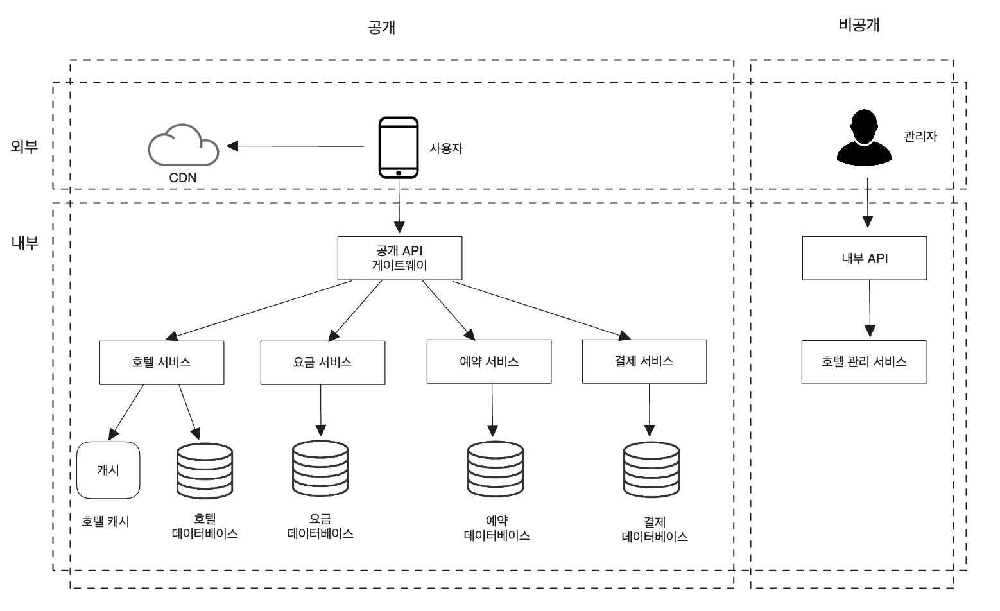

# 7장. 호텔 예약 시스템

이번 장에서는 메리어트 인터내셔널 같은 호텔 체인의 예약 시스템을 설계할 것이다.

## 1단계: 문제 이해 및 설계 범위 확정

### 기능 요구사항

- 호텔 정보 페이지 표시
- 객실 정보 페이지 표시
- 객실 예약 지원
- 호텔이나 객실 정보를 추가/삭제/갱신하는 관리자 페이지 지원
- 초과 예약 지원

### 비기능 요구사항

- 높은 수준의 동시성 지원
- 적절한 지연 시간 (최대 몇 초는 허용)

### 개략적 규모 추정

- 총 5,000개 호텔, 100만 개의 객실이 있다고 가정한다.
- 평균적으로 객실의 70%가 사용 중이고 평균 투숙 기간은 3일로 가정한다.
- 일일 예상 예약 건수 = 약 240,000 (1백만 * 0.7 / 3)
- 초당 예약 건수 = 약 3(240,000 / 하루에 10^5초)
- 시스템 내 모든 페이지의 QPS (최종단계 도달 전 90% 사용자는 이탈하는 것으로 가정)
    - 호텔/객실 상세 페이지: 약 300
    - 예약 상세 정보 페이지: 약 30
    - 객실 예약 페이지: 약 3

## 2단계: 개략적 설계안 제시 및 동의 구하기

### API 설계

- 호텔 관련 API

| API                  | 설명                |
|----------------------|-------------------|
| GET /v1/hotels/id    | 호텔의 상세 정보 반환      |
| POST /v1/hotels      | 신규 호텔 추가 (호텔 직원용) |
| PUT  /v1/hotels/id   | 호텔 정보 갱신 (호텔 직원용) |
| DELETE /v1/hotels/id | 호텔 정보 삭제 (호텔 직원용) |

- 객실 관련 API

| API                            | 설명                |
|--------------------------------|-------------------|
| GET /v1/hotels/:id/rooms/id    | 객실 상세 정보 반환       |
| POST /v1/hotels/:id/rooms      | 신규 객실 추가 (호텔 직원용) |
| PUT  /v1/hotels/:id/rooms/id   | 객실 정보 갱신 (호텔 직원용) |
| DELETE /v1/hotels/:id/rooms/id | 객실 정보 삭제 (호텔 직원용) |

- 예약 관련 API

| API                        | 설명                |
|----------------------------|-------------------|
| GET /v1/reservations       | 로그인 사용자의 예약 이력 반환 |
| GET /v1/reservations/id    | 특정 예약의 상세 정보 반환   |
| POST /v1/reservations      | 신규 예약             |
| DELETE /v1/reservations/id | 예약 취소             |

### 데이터 모델

- 관계형 데이터베이스를 선택한다.
- 읽기 빈도가 쓰기 연산에 비해 높은 작업 흐름을 잘 지원한다.
- ACID 속성을 보장한다.
- 데이터를 쉽게 모델링할 수 있다.

## 개략적 설계안

## 3단계: 상세 설계

### 개선된 데이터 모델

- 호텔을 예약할 때 특정 객실이 아닌, 객실 유형을 예약하게 된다.
    - roomID는 roomTypeID로 변경한다.
    - room: 객실에 관계된 정보를 담는다.
    - room_type_rate: 특정 객실 유형의 특정 일자 요금 정보를 담는다.
    - reservation: 투숙객 예약 정보를 담는다.
    - room_type_inventory: 호텔의 모든 객실 유형을 담는다.
        - hotel_id: 호텔 식별자
        - room_type_id: 객실 유형 식별자
        - date: 일자
        - total_inventory: 총 객실 수에서 일시적으로 제외한 객실 수를 뺀 값
        - total_reserved: 지정된 hotel_id, room_type_id에 예약된 모든 객실의 수

Q. 예약 데이터가 단일 데이터베이스에 담기에 너무 크면 어떻게 할 것인가?
현재/향후 예약 데이터만 저장한다. (예약 이력은 자주 접근하지 않으므로 아카이빙 하거나 냉동 저장소로 옮김)
데이터베이스를 샤딩한다. (샤딩 키는 hotel_id)

### 동시성 문제

1. 같은 사용자가 예약 버튼을 여러 번 누를 수 있다.

- 클라이언트 측 구현: 클라이언트 요청 전송 후 예약 버튼을 비활성화시킨다.
- 멱등 API: 예약 API 요청에 멱등 키를 추가한다. (ex. reservation_id)

2. 여러 사용자가 같은 객실을 동시에 예약하려 할 수 있다.

- 비관적 락: 사용자가 레코드를 갱신하려고 하는 순간 즉시 락을 걸어 동시 업데이트를 방지한다.
    - 변경 중이거나 변경이 끝난 데이터를 갱신하는 일을 막을 수 있다.
    - 구현이 쉽고 모든 갱신 연산을 직렬화하여 충돌을 막는다.
    - 여러 레코드에 락을 걸면 교착 상태(데드락)가 발생할 수 있다.
    - 확장성이 낮다. (성능적 문제)

- 낙관적 락: 여러 사용자가 동시에 같은 자원을 갱신하려 시도하는 것을 허용한다. (버전 번호 사용)
    - 애플리케이션이 유효하지 않은 데이터를 편집하는 일을 막는다.
    - 데이터베이스 자원에 락을 걸 필요가 없다. (버전 번호를 통해 데이터 일관성 유지)
    - 데이터에 대한 경쟁이 치열하지 않은 상황에 적합하다.
    - 데이터에 대한 경쟁이 치열한 상황에서는 성능이 좋지 않다.
    - 예약 QPS가 일반적으로 높지 않기 때문에 호텔 예약 시스템에서 적합하다.

- 데이터베이스 제약 조건 (total_inventroy - total_reserved >= 0)
  - 구현이 쉽다.
  - 데이터에 대한 경쟁이 심하지 않을 때 잘 동작한다.
  - 데이터에 대한 경쟁이 심하면 실패하는 연산 수가 급격히 늘어난다.
  - 데이터베이스 제약 조건은 애플리케이션 코드와 달라서 버전을 통제하기 어렵다.
  - 제약 조건을 허용하지 않는 데이터베이스도 있다.
  - 데이터에 대한 경쟁이 심하지 않은 호텔 예약 시스템에서 적합하다.

### 시스템 규모 확장
### 데이터베이스 샤딩
- 데이터베이스를 여러 대 두고 각각에 데이터의 일부만 보관하도록 한다.
- hotel_id를 샤딩 조건으로 쓰면 좋다.

### 캐시
- 데이터를 보관할 때 낡은 데이터는 자동적으로 소멸되도록 TTL을 설정하는 것이 바람직하다.
- 레디스(Redis)는 해당 상황에 적합하다.
- 요청 가운데 일부만 잔여 객실 데이터베이스가 처리하고 나머지는 캐시가 담당한다.
  - 예약 서비스: API 제공
  - 잔여 객실 캐시: 사전에 잔여 객실 정보를 캐시에 미리 저장해둔다.
  - 잔여 객실 데이터베이스: 잔여 객실 수에 대한 가장 신뢰성 있는 정보가 보관된다.
  - 데이터베이스 부하가 크게 감소한다.
  - 높은 성능을 보장한다.
  - 데이터베이스와 캐시 사이의 데이터 일관성을 100% 유지하기는 어렵다.

### 서비스 간 데이터 일관성
- 2단계 커밋(2PC): 여러 노드에 걸친 원자적 트랜잭션 실행을 보증하는 데이터베이스 프로토콜
  - 모든 노드가 성공하든 실패하든 둘 중 하나로 트랜잭션이 마무리되도록 보증한다.
  - 한 노드에 장애가 발생하면 복구될 때까지 진행이 중단된다.
  - 하나의 트랜잭션을 통해 ACID 속성을 만족시킨다.

- 사가(Saga): 각 노드에 국지적으로 발생하는 트랜잭션을 하나로 엮은 것
  - 어느 한 트랜잭션이라도 실패하면 그 이전 트랜잭션의 결과를 전부 되돌리는 트랜잭션들을 순차적으로 실행한다.
  - 결과적 일관성에 의존한다.

## 4. 마무리
- 개략적인 설계안
  - API 설계
  - 데이터 모델 초안
  - 시스템 아키텍처 다이어그램
- 상세 설계안
  - 데이터베이스 스키마 설계안 변경 (roomId -> roomTypeId)
  - 경쟁조건 발생 조건 및 해결 방안
  - 시스템 규모 확장 전략
    - 데이터베이스 샤딩
    - 레디스 캐시
- 데이터 일관성 문제